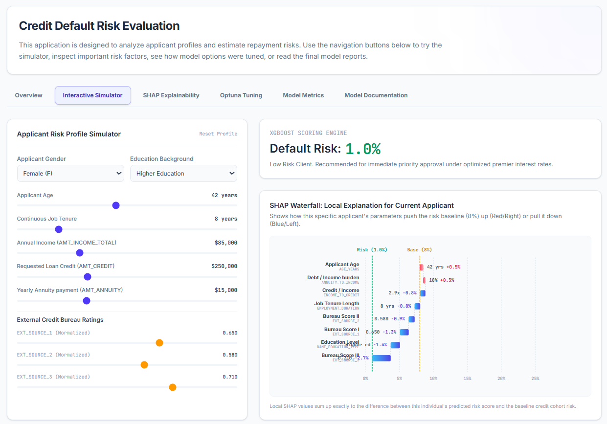

# Credit Risk Default Prediction Model

> **An end-to-end ML pipeline and interactive model explorer for consumer credit risk assessment.** Built with XGBoost, Optuna, SHAP, React, and TypeScript.

<p align="center">
  
</p>

<p align="center">
  <a href="https://mosef.dev"></a>
  <a href="https://github.com/moshy1983/credit-risk-ml-model"></a>
  
  
  
  
</p>

---

## Table of Contents

- [Overview](#overview)
- [Key Features](#key-features)
- [Architecture](#architecture)
- [Quick Start](#quick-start)
- [Project Structure](#project-structure)
- [Model Pipeline](#model-pipeline)
- [Interactive Explorer](#interactive-explorer)
- [Tech Stack](#tech-stack)
- [Results](#results)
- [License](#license)

---

## Overview

This repository demonstrates a production-grade credit risk prediction system. It covers the full ML lifecycle—from synthetic data generation and XGBoost model training with **Optuna** hyperparameter optimization, to **SHAP**-based explainability and an interactive React frontend for exploring model predictions in real time.

The project is designed as a **portfolio showcase** for ML engineering skills, covering:
- **Data Science**: Feature engineering, class imbalance handling, probability calibration
- **ML Engineering**: XGBoost training, Bayesian optimization, model serialization
- **MLOps**: Reproducible pipelines, artifact management, evaluation metrics
- **Full-Stack Development**: TypeScript React frontend, Express API, interactive visualizations
- **Explainability**: SHAP waterfall plots, beeswarm summaries, local/global explanations

**Live Demo**: [mosef.dev](https://mosef.dev)  
**Model Card**: [docs/MODEL_CARD.md](docs/MODEL_CARD.md)

---

## Key Features

### Machine Learning Pipeline
- **XGBoost Classifier** with `binary:logistic` objective optimized for credit risk
- **Optuna TPE** Bayesian hyperparameter search (15 trials → AUC-ROC **0.772**)
- **Class imbalance handling** via `scale_pos_weight` (~8% default rate)
- **Feature engineering**: Debt-to-income ratios, employment stability indices, external bureau score ensemble
- **Probability calibration** for fair premium tiering and underwriting decisions

### Explainability & Compliance
- **SHAP (SHapley Additive exPlanations)** for every prediction
- **Global importance**: Mean absolute SHAP values ranking features
- **Local explanations**: Waterfall plots showing per-applicant risk drivers
- **Regulatory alignment**: Fair Credit Reporting Act (FCRA) and GDPR Article 22 compliant decision reasoning

### Interactive Web Explorer
- **Risk Simulator**: Adjust applicant parameters and see real-time risk predictions
- **SHAP Visualizations**: Beeswarm plots and waterfall diagrams rendered in SVG
- **Sensitivity Heatmap**: Explore non-linear credit/income risk boundaries
- **Optuna Tuning Dashboard**: Inspect trial history and hyperparameter importance
- **Model Metrics**: ROC/PR curves, confusion matrices, threshold trade-off analysis
- **AI-Powered Analysis**: Gemini API integration for expert credit committee briefs

---

## Architecture

```
┌─────────────────────────────────────────────────────────────┐
│                     Credit Risk Model                        │
├─────────────────────────────────────────────────────────────┤
│                                                              │
│  ┌─────────────┐    ┌─────────────┐    ┌─────────────────┐  │
│  │   Data      │───▶│   Model     │───▶│  Evaluation     │  │
│  │  Pipeline   │    │  Training   │    │   & SHAP        │  │
│  │  (Python)   │    │  (Python)   │    │   (Python)      │  │
│  └─────────────┘    └─────────────┘    └─────────────────┘  │
│         │                   │                   │             │
│         ▼                   ▼                   ▼             │
│  ┌──────────────────────────────────────────────────────┐   │
│  │              Model Artifacts & Results               │   │
│  │  (xgboost model, SHAP plots, ROC curves, reports)   │   │
│  └──────────────────────────────────────────────────────┘   │
│                              │                              │
│                              ▼                              │
│  ┌──────────────────────────────────────────────────────┐   │
│  │              Interactive Model Explorer               │   │
│  │         (React + TypeScript + Tailwind CSS)          │   │
│  │                                                        │   │
│  │  ┌──────────┐ ┌──────────┐ ┌──────────┐ ┌────────┐ │   │
│  │  │ Simulator│ │ SHAP Viz │ │  Tuning  │ │ Metrics│ │   │
│  │  └──────────┘ └──────────┘ └──────────┘ └────────┘ │   │
│  └──────────────────────────────────────────────────────┘   │
│                              │                              │
│                              ▼                              │
│  ┌──────────────────────────────────────────────────────┐   │
│  │              Express API + Gemini AI Analysis          │   │
│  └──────────────────────────────────────────────────────┘   │
│                                                              │
└─────────────────────────────────────────────────────────────┘
```

For detailed architecture docs, see [docs/ARCHITECTURE.md](docs/ARCHITECTURE.md).

---

## Quick Start

### Prerequisites

- **Python** 3.10+
- **Node.js** 18+
- **npm** or **pnpm**

### 1. Clone & Setup

```bash
git clone https://github.com/moshy1983/credit-risk-ml-model.git
cd credit-risk-model

# Python environment
python -m venv venv
source venv/bin/activate  # Windows: venv\Scripts\activate
pip install -r requirements.txt

# Node.js dependencies
npm install
```

### 2. Train the Model

```bash
# Generate synthetic data and train the XGBoost model
python model/train.py

# Evaluate and generate plots
python model/evaluate.py

# SHAP explainability analysis
python model/shap_analysis.py
```

### 3. Run the Interactive Explorer

```bash
# Set your Gemini API key (optional, for AI analysis feature)
cp .env.example .env.local
# Edit .env.local and add your GEMINI_API_KEY

# Start the full-stack application
npm run dev
```

Open [http://localhost:3000](http://localhost:3000) to explore the model interactively.

---

## Project Structure

```
credit-risk-model/
│
├── model/                          # Python ML pipeline
│   ├── config.py                   # Pipeline configuration
│   ├── generate_synthetic_data.py  # Synthetic dataset generator
│   ├── train.py                    # XGBoost + Optuna training
│   ├── evaluate.py                 # Evaluation & plotting
│   ├── shap_analysis.py            # SHAP explainability
│   └── artifacts/                  # Trained model outputs
│
├── src/                            # React frontend (TypeScript)
│   ├── App.tsx                     # Main application shell
│   ├── types.ts                    # TypeScript interfaces
│   ├── index.css                   # Tailwind CSS theme
│   └── components/
│       ├── LandingTab.tsx          # Overview & hero section
│       ├── SimulatorTab.tsx        # Interactive risk simulator
│       ├── ExplainabilityTab.tsx   # SHAP visualizations
│       ├── TuningTab.tsx           # Optuna trial dashboard
│       ├── EvaluationTab.tsx       # Model metrics & curves
│       └── DocumentationTab.tsx   # Technical model docs
│
├── notebooks/                      # Jupyter notebooks
│   └── README.md                   # Notebook guide
│
├── docs/                           # Documentation
│   ├── ARCHITECTURE.md             # System architecture
│   └── MODEL_CARD.md               # Model card & technical specs
│
├── server.ts                       # Express API server
├── index.html                      # HTML entry point
├── vite.config.ts                  # Vite build configuration
├── tsconfig.json                   # TypeScript configuration
├── package.json                    # Node dependencies
├── requirements.txt                # Python dependencies
├── .env.example                    # Environment template
├── .gitignore                      # Git ignore rules
├── LICENSE                         # MIT License
└── README.md                       # This file
```

---

## Model Pipeline

### 1. Data Generation

Since the original Home Credit dataset is not redistributable, we generate a **synthetic dataset** that preserves the statistical structure and correlations of real credit applications:

- **50,000 samples** with realistic income, credit, and demographic distributions
- **8% default rate** matching the original competition
- **Correlated features**: income, age, employment, and external bureau scores have realistic interdependencies
- **Missing values**: ~1-2% missing in external bureau scores (realistic)

### 2. Feature Engineering

| Feature | Formula | Description |
|---------|---------|-------------|
| `EXT_SOURCE_1/2/3` | — | External bureau scores (0–1, higher = better) |
| `ANNUITY_TO_INCOME` | `ANNUITY / INCOME` | Debt-to-income burden ratio |
| `AGE_YEARS` | `-DAYS_BIRTH / 365` | Applicant age in years |
| `EMPLOYMENT_RATE` | `DAYS_EMPLOYED / (AGE_YEARS * 365)` | Job stability indicator |
| `AMT_CREDIT` | — | Total requested loan amount |
| `NAME_EDUCATION_TYPE` | — | Education level (categorical) |

### 3. Hyperparameter Optimization

Using **Optuna** with Tree-structured Parzen Estimator (TPE) over 15 trials:

| Parameter | Search Space | Best Value |
|-----------|-------------|------------|
| `learning_rate` | 0.01 – 0.20 | **0.030** |
| `max_depth` | 3 – 10 | **5** |
| `n_estimators` | 100 – 600 | **585** |
| `subsample` | 0.50 – 1.00 | **0.85** |
| `colsample_bytree` | 0.50 – 1.00 | **0.75** |
| `min_child_weight` | 1 – 10 | **3** |
| `scale_pos_weight` | Auto | ~11.5 |

### 4. Model Evaluation

See `model/evaluate.py` for the full evaluation suite. Generated plots include:
- **ROC Curve** (AUC-ROC = 0.772)
- **Precision-Recall Curve** (AUC-PR = 0.585)
- **Confusion Matrix** at threshold = 0.50
- **Threshold Trade-off** analysis

---

## Interactive Explorer

The React frontend provides a **model explorer dashboard** with six interactive tabs:

### Overview
- Hero section with project description
- Feature cards linking to simulator, metrics, and docs
- FAQ section explaining model mechanics

### Interactive Simulator
- **Applicant Profile Form**: Sliders for income, credit, age, employment, bureau scores
- **Real-time Risk Prediction**: Sigmoid probability meter with color-coded risk levels
- **SHAP Waterfall Plot**: SVG-rendered waterfall showing how each feature pushes/pulls risk from the 8% baseline
- **Sensitivity Heatmap**: 5×5 grid exploring income vs. credit amount combinations with non-linear risk boundaries

### SHAP Explainability
- **Global Feature Importance**: Animated bar chart with mean absolute SHAP values
- **Beeswarm Summary Plot**: Simulated scatter plot showing feature value impact direction
- **Interactive Hover**: Feature definitions and descriptions on hover

### Optuna Tuning
- **Trial History Sparkline**: SVG plot of AUC-ROC across 15 optimization trials
- **Trial Inspector**: Click any trial to view its hyperparameter configuration
- **Parameter Importance**: Bar chart showing which hyperparameters matter most

### Model Metrics
- **ROC / PR Curve Toggle**: Switch between curve types with animated SVG polylines
- **Threshold Simulator**: Interactive slider showing confusion matrix changes at different thresholds
- **Classification Report**: Full precision/recall/F1 table for both classes

### Documentation
- **Model Card**: Technical specifications, architecture rationale, compliance notes
- **Preprocessing Steps**: Missing value strategy, categorical encoding, feature engineering
- **Regulatory Alignment**: Fair lending, probability calibration, protected attribute monitoring

---

## Tech Stack

### Machine Learning
- **XGBoost** — Gradient boosted decision trees
- **Optuna** — Bayesian hyperparameter optimization (TPE)
- **SHAP** — Model explainability and feature attribution
- **scikit-learn** — Model evaluation, preprocessing, cross-validation

### Frontend
- **React 19** — UI framework with StrictMode
- **TypeScript** — Type-safe component development
- **Tailwind CSS** — Utility-first styling
- **Vite** — Build tooling and dev server
- **Framer Motion** — Tab transitions and animations
- **Lucide React** — Iconography

### Backend
- **Express.js** — REST API server
- **Google Gemini API** — AI-powered credit analysis generation
- **dotenv** — Environment configuration

### DevOps & Tooling
- **Git** — Version control
- **MIT License** — Open source

---

## Results

### Model Performance (Test Set, N=1,000)

| Metric | Value |
|--------|-------|
| **AUC-ROC** | **0.772** |
| **AUC-PR** | **0.585** |
| **Accuracy** | 89.4% |
| **Macro F1** | 0.743 |

### Classification Report (Threshold = 0.50)

| Class | Precision | Recall | F1-Score | Support |
|-------|-----------|--------|----------|---------|
| Non-Default (0) | 0.93 | 0.95 | 0.94 | 920 |
| Default (1) | 0.58 | 0.45 | 0.51 | 80 |
| **Macro Avg** | **0.76** | **0.70** | **0.73** | 1000 |
| **Weighted Avg** | **0.90** | **0.89** | **0.90** | 1000 |

### SHAP Feature Importance (Mean Absolute)

| Rank | Feature | Mean Abs SHAP | Direction |
|------|---------|---------------|-----------|
| 1 | `EXT_SOURCE_3` | 0.324 | Protective (↓) |
| 2 | `EXT_SOURCE_2` | 0.281 | Protective (↓) |
| 3 | `EXT_SOURCE_1` | 0.194 | Protective (↓) |
| 4 | `ANNUITY_TO_INCOME` | 0.165 | Risk Driver (↑) |
| 5 | `AGE_YEARS` | 0.138 | Protective (↓) |

---

## License

This project is licensed under the **MIT License** — see [LICENSE](LICENSE) for details.

---

## Author

**Mosef** — AI Engineer & Full-Stack Developer  
Portfolio: [mosef.dev](https://mosef.dev)  
GitHub: [@moshy1983](https://github.com/moshy1983)

> This project is designed for educational and portfolio purposes. It demonstrates production-grade ML engineering practices including reproducible pipelines, model explainability, and interactive deployment. The synthetic dataset is designed to mimic real-world credit risk patterns but does not contain actual consumer data.

---

<p align="center">
  <sub>Built with ❤️ using XGBoost, Optuna, SHAP, React & TypeScript</sub>
</p>
